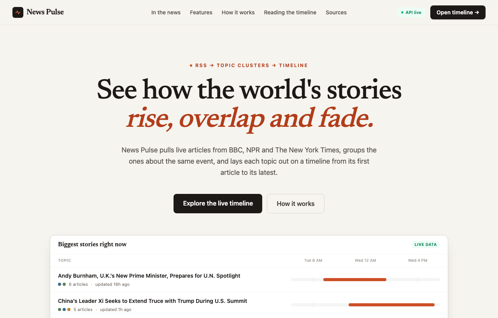
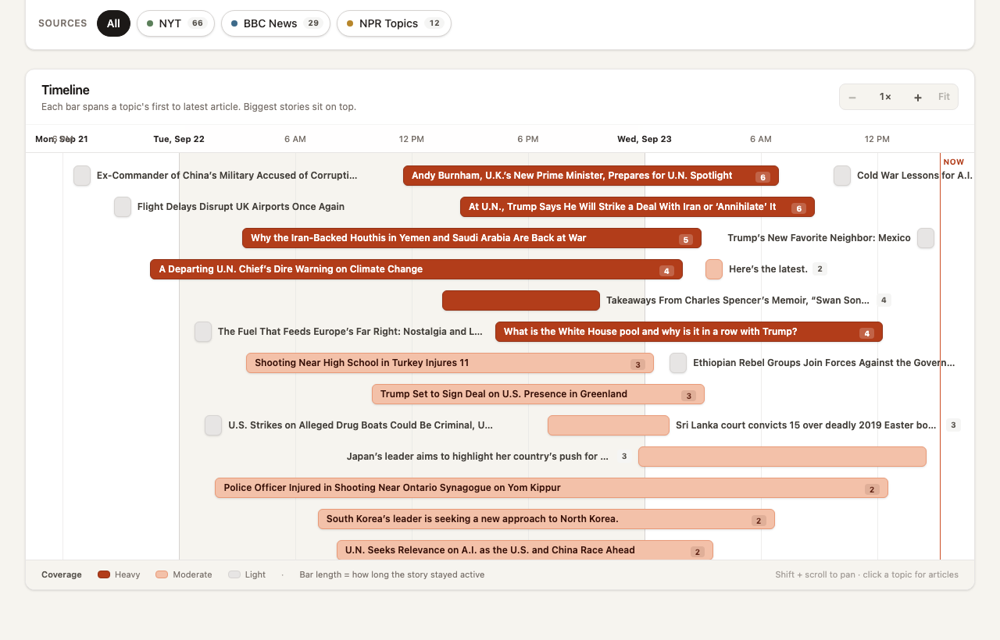
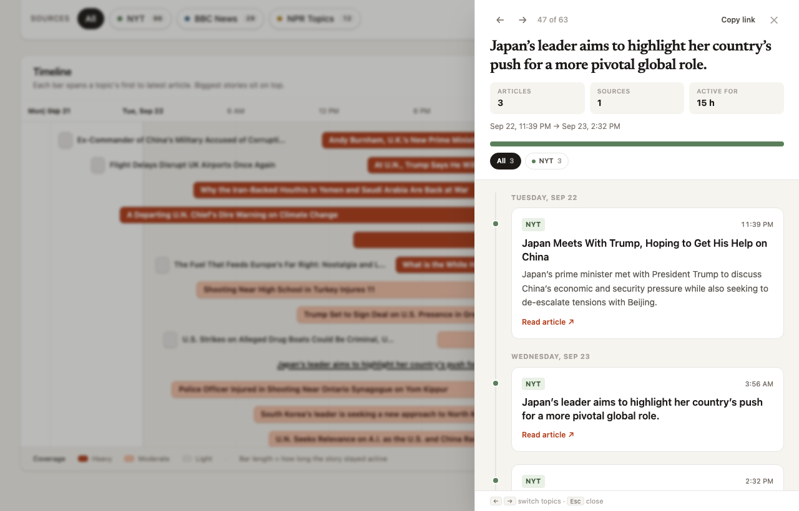
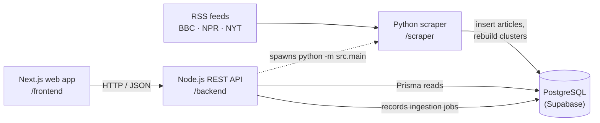
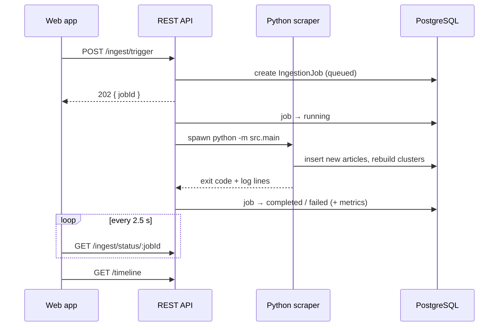
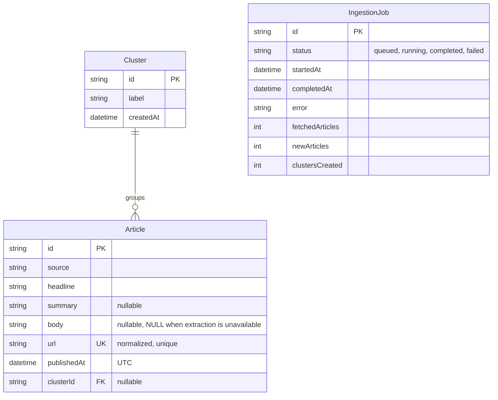

# News Pulse

**A topic-clustered news timeline.** News Pulse collects live articles from BBC News, NPR and The New York Times. It groups articles that cover the same event into topic clusters and shows each topic on an interactive timeline, from its first article to its latest.

| | |
| --- | --- |
| **Live app** | **<https://news-pulse-theta-sage.vercel.app>** · timeline: <https://news-pulse-theta-sage.vercel.app/timeline> |
| **Live API** | <https://news-pulse-api-tgxl.onrender.com> · try [`/timeline`](https://news-pulse-api-tgxl.onrender.com/timeline), [`/clusters`](https://news-pulse-api-tgxl.onrender.com/clusters), [`/stats`](https://news-pulse-api-tgxl.onrender.com/stats), [`/health/db`](https://news-pulse-api-tgxl.onrender.com/health/db) |
| **Video walkthrough** | _add link_ |

> The API runs on Render's free tier, which sleeps after 15 idle minutes. The first request after that can take about a minute while it wakes up.



| Timeline | Topic details |
| --- | --- |
|  |  |

---

## Contents

- [What it does](#what-it-does)
- [How it works](#how-it-works)
- [Tech stack](#tech-stack)
- [Repository layout](#repository-layout)
- [Getting started](#getting-started)
- [Configuration](#configuration)
- [API at a glance](#api-at-a-glance)
- [Data model](#data-model)
- [Key design decisions](#key-design-decisions)
- [Testing](#testing)
- [Deployment](#deployment)
- [Assumptions](#assumptions)
- [Known limitations](#known-limitations)
- [Further documentation](#further-documentation)

---

## What it does

- **Collects news** from three public RSS feeds and, where the publisher allows it, the full article text.
- **Groups related stories.** Articles about the same event, from any outlet, form one topic, using TF-IDF and cosine similarity.
- **Shows topics over time.** Each topic is a bar on the timeline: where it starts is when the first article appeared, its length is how long the story kept getting coverage, and its colour is how heavily it was covered.
- **Lets you explore:**
  - search topics, filter by source and time range, and hide single-article topics
  - switch between a timeline view and a ranked list view
  - open any topic to read its articles in order, grouped by day
- **Refreshes on demand.** *Refresh Data* runs a new ingestion in the background and reloads the timeline when it finishes. Each run is recorded as a job in the database, so its status survives server restarts.

## How it works

Three separate services share one PostgreSQL database. Each has one job.



1. **The scraper (Python)** fetches the feeds, normalizes each item (URL, date, text), skips articles it already has, downloads only the new pages, and stores them. It then groups all stored articles into topics and replaces the clusters in one transaction.
2. **The API (Node.js + Express + Prisma)** serves topics, articles, sources and statistics. It starts the scraper as a subprocess when asked, and records each run's status and metrics.
3. **The web app (Next.js)** draws the timeline, handles filtering and search, and polls the API while a refresh is running.

What happens when you press *Refresh Data*:



A deeper walk-through is in [architecture.md](architecture.md).

## Tech stack

| Layer | Technology |
| --- | --- |
| Ingestion and clustering | Python 3.11+, feedparser, requests, trafilatura, BeautifulSoup, scikit-learn (TF-IDF), SciPy (hierarchical clustering), psycopg 3 |
| Database | PostgreSQL, hosted on Supabase |
| API | Node.js 22.18+ (24 used), Express 5, Prisma 7 (`@prisma/adapter-pg`), ES modules |
| Web app | Next.js 16 (App Router), React 19, Tailwind CSS 4 |
| Tests | Jest + Supertest (API), unittest (scraper) |

## Repository layout

```text
news-pulse/
├── scraper/                     Python ingestion pipeline
│   ├── src/
│   │   ├── main.py              entry point: python3 -m src.main
│   │   ├── config.py            environment settings
│   │   ├── rss/fetcher.py       download and parse feeds
│   │   ├── extraction/          full-text extraction (thread pool)
│   │   ├── grouping/            TF-IDF clustering and labels
│   │   ├── storage/postgres.py  batched inserts, transactional cluster rebuild
│   │   └── utils/               URL, date and text normalization
│   └── tests/                   94 offline unit tests + opt-in live checks
│
├── backend/                     Node.js REST API
│   ├── prisma/                  schema.prisma + migrations
│   ├── src/
│   │   ├── routes/ → controllers/ → services/ → Prisma
│   │   ├── middleware/          404 and central error handler
│   │   └── server.js            startup (recovers interrupted jobs)
│   └── tests/                   Jest + Supertest, Prisma mocked
│
├── frontend/                    Next.js web app
│   └── app/
│       ├── page.js              landing page (live preview)
│       ├── timeline/page.js     the timeline application
│       ├── components/          Timeline, ClusterDrawer, ClusterList, …
│       └── lib/format.js        formatting, source colours, coverage tiers
│
├── docs/                        API reference and screenshots
├── architecture.md              how the system fits together
└── prd.md, design.md, rules.md, tasks.md, memory.md   original planning notes
```

## Getting started

### Prerequisites

- **Node.js 22.18+** and npm (24 recommended). The API imports Prisma's generated TypeScript client directly, which Node runs natively from 22.18
- **Python 3.11+** (SciPy 1.17 requires it)
- **A PostgreSQL database.** A free Supabase project works. Use the **direct** connection string (port 5432), because Prisma migrations need it.

### 1. Clone and configure

```bash
git clone <repository-url> news-pulse
cd news-pulse

cp backend/.env.example backend/.env
cp scraper/.env.example scraper/.env
echo "NEXT_PUBLIC_API_URL=http://localhost:5001" > frontend/.env
```

Set the same `DATABASE_URL` in `backend/.env` and `scraper/.env`, and set `PORT=5001` in `backend/.env` to match the frontend.

### 2. Scraper: install

```bash
cd scraper
python3 -m venv venv
source venv/bin/activate          # Windows: venv\Scripts\activate
pip install -r requirements.txt
cd ..
```

### 3. Backend: install, create tables, start

```bash
cd backend
npm install
npx prisma migrate deploy         # creates Article, Cluster, IngestionJob
npx prisma generate
npm run dev                       # http://localhost:5001
```

The backend launches the scraper itself, so it must use the scraper's virtual environment. In `backend/.env`:

```env
PYTHON_COMMAND=../scraper/venv/bin/python   # Windows: ..\scraper\venv\Scripts\python.exe
SCRAPER_PATH=../scraper
```

### 4. Frontend: install and start

```bash
cd frontend
npm install
npm run dev                       # http://localhost:3000
```

### 5. Load the first articles

Open <http://localhost:3000/timeline> and press **Refresh Data**, or run the scraper directly:

```bash
cd scraper && source venv/bin/activate
python3 -m src.main
```

A run ends with a summary like this (real output from a re-run with nothing new):

```text
[PIPELINE] INGESTION SUMMARY
[PIPELINE] Feeds processed:        3/3
[PIPELINE] RSS articles fetched:   95
[PIPELINE] Already known:          95
[PIPELINE] New articles:           0 found, 0 inserted
[PIPELINE] Extraction success:     0
[PIPELINE] Extraction unavailable: 0
[PIPELINE] Clusters:               unchanged (skipped)
[PIPELINE] Duration:               1.1s
```

## Configuration

Secrets live only in `.env` files, which git ignores. Every service ships a `.env.example`.

| Service | Variable | Default | Purpose |
| --- | --- | --- | --- |
| backend | `DATABASE_URL` | — | PostgreSQL connection string |
| backend | `PORT` | `5000` | API port (the frontend expects `5001` unless you change it) |
| backend | `FRONTEND_URL` | `http://localhost:3000` | Allowed CORS origin(s), comma-separated |
| backend | `PYTHON_COMMAND` | `python3` | Python used to run the scraper; point it at the scraper's venv |
| backend | `SCRAPER_PATH` | `../scraper` | Scraper directory, relative to `backend/` |
| scraper | `DATABASE_URL` | — | Same database as the backend |
| scraper | `RSS_FEEDS` | BBC, NPR, NYT world feeds | Comma-separated feed URLs |
| scraper | `SIMILARITY_THRESHOLD` | `0.12` | How similar articles must be to share a topic |
| scraper | `ARTICLE_TIMEOUT_SECONDS` | `10` | Timeout per article page |
| scraper | `EXTRACTION_CONCURRENCY` | `5` | Parallel page downloads |
| scraper | `MAX_CLUSTER_TEXT_LENGTH` | `1000` | Body characters used for clustering |
| frontend | `NEXT_PUBLIC_API_URL` | `http://localhost:5001` | Base URL of the API |

## API at a glance

| Method | Path | Returns |
| --- | --- | --- |
| GET | `/health` | Service status (does not touch the database) |
| GET | `/health/db` | Database connectivity; `503` when unreachable |
| GET | `/timeline` | Every topic with start, end, article count, intensity and per-source counts |
| GET | `/clusters` | Topics, newest activity first |
| GET | `/clusters/:id` | One topic and its articles |
| GET | `/sources` | Sources present in the data, with article counts |
| GET | `/stats` | Article, cluster and source counts, plus the last completed ingestion |
| POST | `/ingest/trigger` | Starts an ingestion; `202` with a `jobId`, or `409` if one is running |
| GET | `/ingest/status/:jobId` | Job status and metrics |

Full request and response examples, and every error code: **[docs/api.md](docs/api.md)**.

## Data model



- **Who writes what.** Python writes `Article` and `Cluster`. Node writes `IngestionJob`. Prisma owns the schema and migrations.
- **`UNIQUE(url)`** is the final guard against duplicate articles.
- **Articles are never deleted.** Clusters are rebuilt as a whole (see below).

## Key design decisions

These are the choices with trade-offs. The component READMEs explain each one in detail.

1. **Clustering: TF-IDF with average linkage, threshold 0.12, chosen by measurement.**
   - **Method.** Articles are compared by TF-IDF cosine similarity. Two groups merge only if their *average* similarity reaches the threshold. This stops chains like A~B~C from joining unrelated A and C, and the result doesn't depend on input order.
   - **Before.** The first version depended on database row order: 20 row orders gave 20 different groupings.
   - **Evidence.** The threshold and text preparation were picked by scoring hand-labelled real articles. Precision is 0.97 and recall 1.00, against a 0.55 average precision before. See [scraper/README.md](scraper/README.md#choosing-the-threshold-012).
2. **Clusters are rebuilt, not updated incrementally.**
   - **Why.** New articles can change which older articles belong together, so all topics are recomputed together and swapped in one transaction. A failure leaves the previous clusters untouched.
   - **Skipped when idle.** Rebuilds only happen when something changed, so a re-run with nothing new costs about a second.
3. **Duplicates are stopped twice.**
   - URLs are normalized (tracking parameters like `utm_*` removed), and known articles are dropped before any page is downloaded.
   - `ON CONFLICT (url) DO NOTHING` and the unique index are the final guard.
4. **Paywalls are respected.**
   - nytimes.com answers automated requests with HTTP 403. The scraper doesn't try to get around it: NYT articles keep their RSS headline and summary, and `body` is NULL.
   - Each run probes a site once; if the site refuses, its remaining articles are not requested.
5. **Ingestion jobs are durable.**
   - Job status lives in PostgreSQL rather than memory, so polling works across restarts.
   - A job interrupted by a restart is marked `failed` on startup, so it can't block new runs forever.
6. **No extra infrastructure.** No queue, cache, WebSocket or embeddings service. One database, one subprocess and polling are enough for this scale, and they are easy to reason about.

## Testing

```bash
# API: 31 tests, Prisma mocked, no database needed
cd backend && npm test

# Scraper: 94 tests, fully offline
cd scraper && python3 -m unittest discover -s tests -v

# Scraper: optional read-only live checks (real feeds + database)
RUN_INTEGRATION_TESTS=true python3 -m unittest tests.test_integration -v

# Web app: lint and production build
cd frontend && npm run lint && npm run build
```

- **API tests** cover every endpoint, the whole job lifecycle (queued → running → completed/failed), 404/409 cases, and a job being read after a restart.
- **Scraper tests** cover URL and date normalization, malformed feeds and items, HTTP 403/404/timeouts, the clustering rules, labels, batched inserts, and transaction rollback.

## Deployment

**Live:** web app <https://news-pulse-theta-sage.vercel.app> · API <https://news-pulse-api-tgxl.onrender.com>

| Component | Runs on | Why |
| --- | --- | --- |
| Web app | Vercel | Built for Next.js; free CDN hosting |
| API + scraper | Render, one Docker image (`backend/Dockerfile`, `render.yaml`) | The API runs the Python scraper as a subprocess, so both share one container with Node 24 and Python 3.11 |
| Database | Supabase PostgreSQL | Hosted Postgres; the app connects through the **Session pooler** (IPv4), because the direct host is IPv6-only and Render can't reach it |
| Scheduled refresh (optional) | GitHub Actions cron | Triggers an ingestion every 6 hours so the live data stays current |

Secrets are set in each platform's environment settings, never committed. Step-by-step instructions, the verification that was done, and troubleshooting: **[docs/deployment.md](docs/deployment.md)**.

## Assumptions

The brief leaves these open; this is how News Pulse decides them.

- **"Topic" means one news event or story,** not a broad category. "Sri Lanka convicts 15 over Easter bombings" is a topic; "Asia" is not. The similarity threshold was tuned for that granularity.
- **Sources are the three outlets' world-news feeds** (BBC World, NPR World, NYT World). They overlap on the same events, which is what makes cross-source topics possible.
- **Paywalls are respected.** Where a site refuses automated access (NYT returns HTTP 403), the article is kept with its RSS headline and summary, and no full text is stored.
- **A missing publication date becomes the fetch time.** The item is in the live feed at that moment, so this is a close approximation. The fallback is logged and counted, and the item is not dropped.
- **A topic's time span runs from its earliest to its latest article.** A single-article topic is a point in time, drawn as a short bar.
- **"Intensity" is relative.** It is a topic's article count divided by the largest topic's count, so the colours compare topics within the current data.
- **Every stored article is shown.** There is no retention window yet, and single-article topics are visible (a filter can hide them).
- **Topics are rebuilt when new articles arrive,** so topic IDs and shared `?topic=` links last until the next refresh.
- **One ingestion runs at a time.** Pressing *Refresh Data* during a run joins that run instead of starting another.

## Known limitations

- **NYT full text is unavailable** (HTTP 403). NYT topics are clustered on headline + summary.
- **Every change re-clusters all stored articles.** Fine at hundreds of articles; at much larger scale, clustering should be limited to a recent window (for example the last 7 days).
- **Small labelled set.** The similarity threshold was tuned on one day of news (103 articles) and should be re-checked as sources change.
- **Rare double run.** The "is a job already running?" check and the job insert are two queries. Two triggers within milliseconds could both start a run. That's harmless for a manual button; automated triggers would need a database lock.
- **Metrics depend on log wording.** The API reads job metrics from the scraper's log lines; if that wording changes, the metrics become `null` (the job status is unaffected).
- **No authentication.** Anyone who can reach the API can trigger an ingestion. That's acceptable for a demo; put it behind auth or rate limiting before exposing it publicly.

## Further documentation

| Document | What's in it |
| --- | --- |
| [architecture.md](architecture.md) | Components, data flow, transactions, failure handling |
| [docs/api.md](docs/api.md) | Full REST API reference |
| [docs/deployment.md](docs/deployment.md) | Vercel + Render + Supabase deployment, verification, troubleshooting |
| [scraper/README.md](scraper/README.md) | Normalization, extraction, clustering algorithm and threshold experiment |
| [backend/README.md](backend/README.md) | API internals, ingestion job lifecycle |
| [frontend/README.md](frontend/README.md) | Pages, components, state, design system |
| [prd.md](prd.md), [design.md](design.md), [rules.md](rules.md), [tasks.md](tasks.md) | Original requirements and planning notes, written before implementation |
