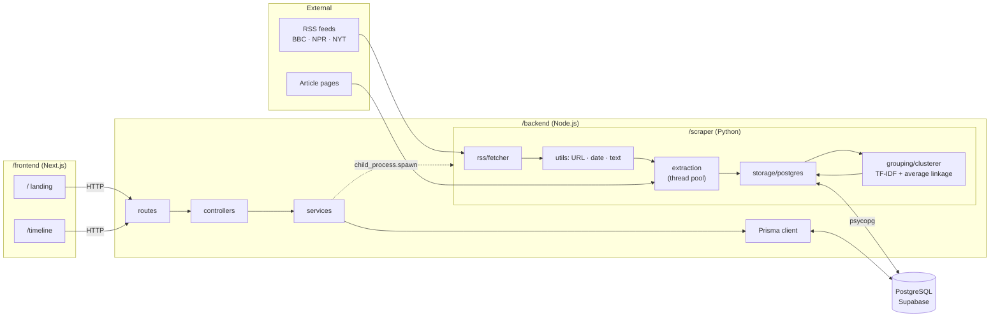
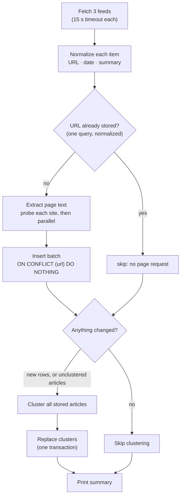
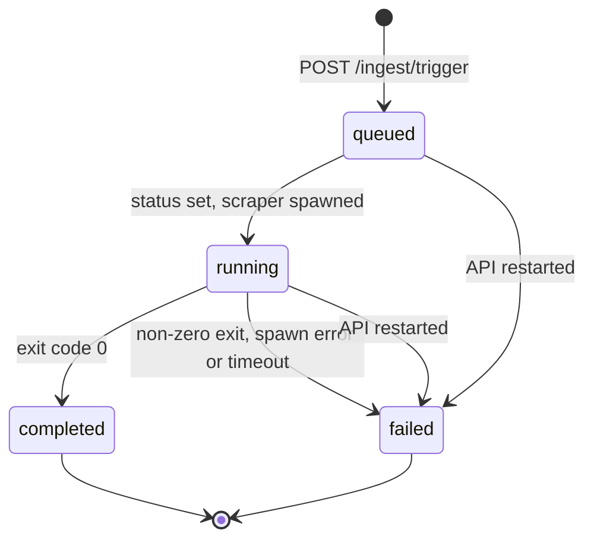

# News Pulse — Architecture

How the system is put together, how data moves through it, and why it is built this way. For setup, see the [README](README.md). For endpoint details, see [docs/api.md](docs/api.md).

> This document describes the implemented system. The pre-implementation plan it replaces is in git history. [prd.md](prd.md) and [design.md](design.md) still hold the original requirements.

## 1. Goals and constraints

- **Three technologies, three jobs.** Python collects and groups articles, Node serves them and controls ingestion, and Next.js visualizes. Each lives in its own folder (`/scraper`, `/backend`, `/frontend`).
- **Re-runnable ingestion.** Running it twice must never duplicate articles, and a run with nothing new should be cheap.
- **Understandable over clever.** One database, no queues, caches or ML services. Every mechanism should be explainable in a few sentences.

## 2. Components

| Component | Responsibility | Talks to |
| --- | --- | --- |
| **Scraper** (`/scraper`) | Fetch feeds, normalize, deduplicate, extract full text, store articles, cluster, store clusters | RSS feeds, article pages, PostgreSQL (psycopg) |
| **API** (`/backend`) | Serve topics, articles, sources and stats; start and track ingestion jobs | PostgreSQL (Prisma), the scraper (subprocess) |
| **Web app** (`/frontend`) | Landing page, timeline, filters, topic drawer, refresh flow | The API only |
| **Database** | Single source of truth | — |

The web app never talks to the database, and the API never parses RSS. Each boundary is one interface: HTTP between the web app and the API, a subprocess plus the database between the API and the scraper.

## 3. Data model

Prisma owns the schema (`backend/prisma/schema.prisma`) and its migrations. The scraper writes to the same tables with SQL.

| Table | Written by | Key columns | Notes |
| --- | --- | --- | --- |
| `Article` | scraper | `url` UNIQUE, `publishedAt` (UTC), `clusterId` → `Cluster.id` | `body` is NULL when the publisher blocks extraction. Rows are never deleted. Indexed on `clusterId` and `publishedAt` |
| `Cluster` | scraper | `id`, `label` | Rebuilt as a whole on each ingestion that changes data |
| `IngestionJob` | API | `status`, `startedAt`, `completedAt`, `error`, metrics | Indexed on `status` and `createdAt`; a partial unique index allows only one queued/running job |

- **Foreign key.** `Article.clusterId` has `ON DELETE SET NULL`, so deleting a cluster can never leave an article pointing at nothing.
- **Timestamps.** Stored as `timestamp` columns holding UTC. The scraper pins its session to UTC before writing.

## 4. Ingestion pipeline

`python3 -m src.main`, run by the API or by hand, performs one run:

### 4.1 Normalization

- **URLs.** Trimmed; scheme and host lowercased; default port, fragment and trailing slash removed; known tracking parameters (`utm_*`, BBC's `at_medium`/`at_campaign`, `fbclid`, …) dropped; remaining parameters sorted. Stored URLs are normalized the same way before comparing, so rows saved before normalization still match.
- **Dates.** feedparser's pre-parsed UTC time is used first, then RFC 822 / ISO 8601 strings. Everything is converted to UTC. Dates more than 24h in the future or before 1990 are rejected. A missing date falls back to the fetch time, and the fallback is logged and counted.
- **Items.** An item without a title or http(s) link is skipped and counted. A malformed item never stops its feed; a failed feed never stops the others.

### 4.2 Extraction

- **Scope.** Only new articles are downloaded, through a bounded thread pool (`EXTRACTION_CONCURRENCY`, default 5).
- **Probe wave.** The first request to each site goes out alone. If the site answers 401/403/429/451, the rest of its articles are skipped **for this run only**.
- **Text.** `trafilatura` extracts the main text, falling back to paragraphs inside `<article>`. Anything under 200 characters counts as "no article text".
- **Paywalls.** They are respected. NYT answers 403, so its articles keep the RSS headline and summary, with `body` NULL.

### 4.3 Clustering

1. **Documents.** Each document is headline + summary + the first 1,000 characters of the body, with site boilerplate removed, then lowercased and stripped of punctuation.
2. **Similarity.** TF-IDF vectors (English stop words, sublinear term frequency), compared with cosine similarity.
3. **Grouping.** Average-linkage agglomerative clustering. Groups merge while their *average* pairwise similarity is at least `SIMILARITY_THRESHOLD` (0.12).
   - Chains don't form: if A~B and B~C but A and C are unrelated, C joins only if it is similar to the group as a whole.
   - The result is independent of input order.
4. **Labels.** Each topic is labelled with the member headline closest to the topic's centre, so labels are always real headlines. Duplicate labels get a distinguishing term appended.

The threshold, the 1,000-character limit and the boilerplate rule were chosen by scoring hand-labelled real articles (precision 0.97, recall 1.00). The full experiment is in [scraper/README.md](scraper/README.md#choosing-the-threshold-012).

### 4.4 Writing to the database

| Step | Statements | Transaction |
| --- | --- | --- |
| Read known URLs | 1 `SELECT` | autocommit |
| Insert new articles | 1 `INSERT … SELECT FROM unnest(…) ON CONFLICT (url) DO NOTHING RETURNING url` | 1 |
| Replace clusters | advisory lock → unlink all → delete all → insert all → link all → verify count | 1 |

- **Rollback.** If any step of the cluster replacement fails, the whole transaction rolls back and the previous clusters stay in place.
- **Overlapping runs.** The advisory lock serializes cluster rebuilds even if two scraper runs ever overlap.

## 5. Ingestion jobs (API ↔ scraper)

1. **Trigger.** `POST /ingest/trigger` checks for a `queued` or `running` job and returns `409` with its ID if there is one. Otherwise it inserts a `queued` job and answers `202` immediately.
2. **Run.** In the background the job becomes `running` (with `startedAt`), and `PYTHON_COMMAND -m src.main` is spawned with `cwd = SCRAPER_PATH`.
3. **Metrics.** Node reads the scraper's stdout and stderr line by line. Four fixed log phrases give the metrics: `Fetched N total articles`, `Found N new articles`, `Inserted N new articles` and `Formed N clusters`.
4. **Finish.** On exit the job becomes `completed` or `failed`, with `completedAt` and metrics. A failed job stores the last 500 characters of output, with connection strings redacted.
5. **Timeout.** A run still going after `INGEST_TIMEOUT_MINUTES` (default 5) gets `SIGTERM`, then `SIGKILL` after 10 s. The job is marked `failed` once the process has exited, so a hung run can never block triggers indefinitely.
5. **Startup recovery.** Any job still `queued` or `running` is marked `failed` when the API starts, because its process belonged to the previous server.

Because jobs live in PostgreSQL, `GET /ingest/status/:jobId` keeps working across restarts, and `/stats` can report the last successful run.

## 6. Web app

| Route | What it shows |
| --- | --- |
| `/` | Landing page. Fetches `/timeline` once and shows the biggest stories, multi-outlet stories, live stats and source shares. Falls back to clearly labelled sample data if the API is offline |
| `/timeline` | The application: stats, search, time-range and source filters, timeline or list view, topic drawer, *Refresh Data* |

Details:
- **Timeline layout.** Computed in the browser. The time axis ticks on round hours and days. Each topic is packed into the first lane where its bar and label fit, biggest topics first. Titles too long for their bar are drawn beside it.
- **State.** Filters and search live in React state. The open topic is kept in the URL (`?topic=<id>`) so it can be shared. The chosen view (timeline or list) is remembered in `localStorage`.
- **Auto-refresh.** The page refetches `/timeline` every 5 minutes. *Refresh Data* starts an ingestion and polls its status every 2.5 seconds.

See [frontend/README.md](frontend/README.md) for components and the design system.

## 7. Failure handling

| Failure | Effect |
| --- | --- |
| One feed down or malformed | Logged; other feeds continue |
| Malformed item, missing title/link, bad date | Item skipped or date fallback, counted in the summary |
| Article page 403 / 404 / timeout / bad HTML | Article kept with RSS text, `body` NULL |
| Every feed fails | Run exits 1, job `failed` |
| Database unreachable, or a transaction fails | Run exits 1, job `failed`; the cluster rebuild rolls back |
| API restarts mid-run | Job marked `failed` on startup |
| Scraper hangs | Stopped after `INGEST_TIMEOUT_MINUTES` (SIGTERM, then SIGKILL); job marked `failed` |
| API unreachable from the web app | Error banner with *Try again*; the landing page shows sample data |
| `GET /health/db` while the database is down | `503` |

## 8. Running in production

- **Python on the API host.** The API host must have Python and the scraper installed, because the API runs the scraper as a subprocess. Set `PYTHON_COMMAND` to that environment's Python and `SCRAPER_PATH` to the scraper directory.
- **One database.** The API and the scraper use the same `DATABASE_URL`. Run `npx prisma migrate deploy` once per environment.
- **Frontend settings.** Build the frontend with `NEXT_PUBLIC_API_URL` set to the public API URL, and set the API's `FRONTEND_URL` to the frontend's origin for CORS.
- **Access control.** The API has no authentication. Anyone who can reach it can start ingestion runs, so restrict access or rate-limit `/ingest/trigger` before exposing it publicly.

## 9. Scaling limits and next steps

| Limit today | Why it is fine now | What to do later |
| --- | --- | --- |
| Clustering compares every stored article pair (O(n²)) | ~100 articles cluster in well under a second | Cluster only a recent window (e.g. 7 days) |
| Topic IDs change on every rebuild | Links only need to last until the next refresh | Match new clusters to old ones by overlap to keep IDs stable |
| Metrics parsed from log text | The phrases are documented and tested | Have the scraper print a final JSON summary line |
| NYT bodies unavailable | Headline + summary still cluster well (they are in the labelled set) | Add sources that allow extraction |
